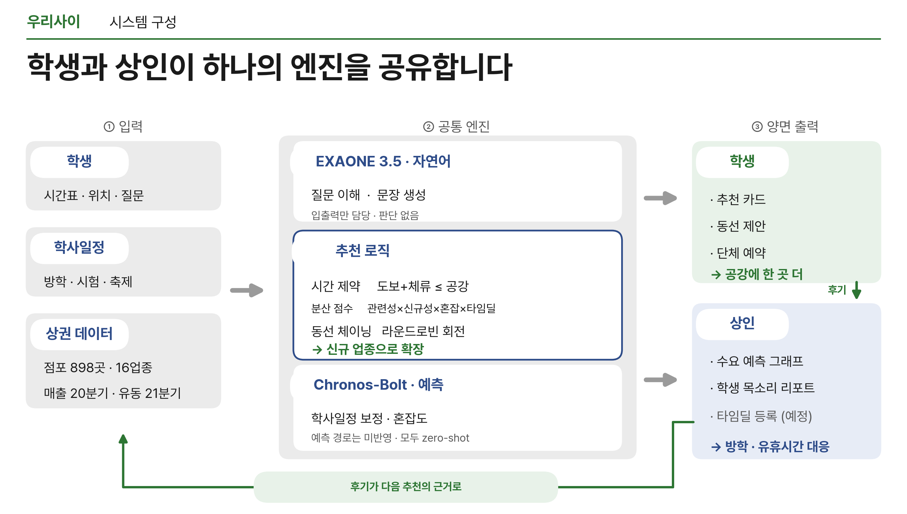
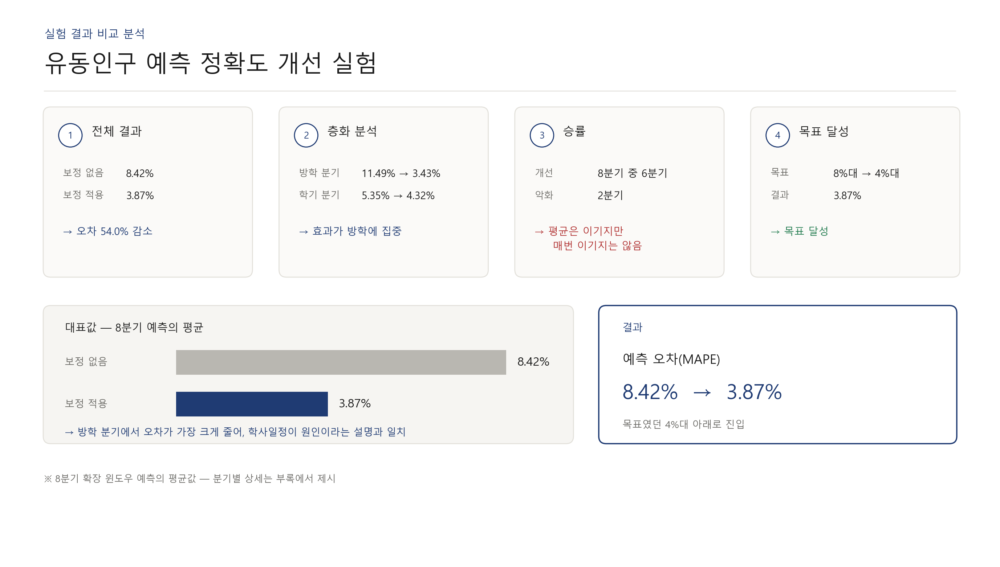

# 우리사이 (Woorisai) — Campus Commercial-District Matching Platform

> An AI platform that takes a student's **free time and current need**, and returns
> **the right place within the neighborhood** — built to spread consumption away from
> the food-service concentration that dominates a college town's spending.

🏆 **Grand Prize (전체 대상), AICOSS Hackathon** — Team 6

*Korean version → [README.ko.md](README.ko.md)*

---

## The problem

Hoegi-dong (home to Kyung Hee University and Hankuk University of Foreign Studies)
is a classic college commercial district, and its spending is dangerously
lopsided:

| Category | Share of district spending |
|---|---|
| Meals (식사) | 32.5% |
| Light bites / cafés (가볍게) | 32.6% |
| **Food service combined** | **65.1%** |

When two thirds of money flows to one kind of store, the other ~830 businesses
fight over the rest, and a student's default is always "where do I eat." We
measured this concentration with the **Herfindahl–Hirschman Index (HHI)** and set
out to lower it — not by advertising, but by **matching students to places they
would not have thought of**, sized to the exact gap in their timetable.

---

## What it does

A student says, in plain language, *"I've got an hour before class, need to print
something."* The platform:

1. reads the timetable to know **exactly how long the gap is**,
2. filters to places reachable and finishable **within that gap**,
3. deliberately **diversifies the categories** it suggests (longer gap → more and
   more varied activities), and
4. writes the answer back in natural language.

It also aggregates **anonymous student reviews into consulting reports for shop
owners**, surfacing trending keywords ("students keep asking for X") so the supply
side can respond.

## Demo & materials

https://github.com/user-attachments/assets/22236877-0792-404f-ab25-c83657bf655f

- 📄 **Idea proposal deck (46p):** [docs/아이디어_제안서.pdf](docs/아이디어_제안서.pdf) — problem, solution, AI plan, business model, impact
- 📊 **Presentation deck (14p):** [docs/발표자료.pdf](docs/발표자료.pdf)

---

## Architecture



### Design philosophy — *"Code decides, the LLM only translates."*

The single most important decision in this project: **anything where a wrong number
is unacceptable is computed in plain Python, never by a model.** The LLM is confined
to the two ends of the pipe — turning language into a structured query, and turning
a computed result back into a sentence.

| Stage | Owner | Why |
|---|---|---|
| ① Parse request → `{minutes, purpose}` | **EXAONE 3.5** | language understanding |
| ② Compute the free window | **Python** (`free_window`) | timetable math must be exact |
| ③ Filter by distance/time, diversify categories | **Python** (`app/logic.py`) | deterministic, auditable |
| ④ Congestion forecast | **Chronos-Bolt** | precomputed time series |
| ⑤ Render result → sentence | **EXAONE 3.5** | fluent output |

This boundary is why the assistant never hallucinates a travel time or invents a
store: those values are produced by code, and the model only phrases them.

---

## The three zero-shot models

| Model | Role | Runs | GPU |
|---|---|---|---|
| **EXAONE 3.5 7.8B-Instruct** | NL → structured query; result → sentence; review classification | real-time | yes |
| **Chronos-Bolt (base)** | per-hour congestion forecasting from a living-population time series | batch (4–6×/day) | no (CPU ok) |
| **BGE-M3** | matches shop tasks ↔ student profiles (auxiliary) | once per registration (cached vectors) | negligible |

All three are used **zero-shot** — no fine-tuning — which keeps the system portable
and the results reproducible.

---

## Key results

### 1. Category diversification lowers concentration

The recommendation engine scores each candidate by

```
dispersion score
  = relevance × novelty × congestion-penalty × time-deal-bonus

  novelty = clamp((5.0 / share)^0.35, 0.7, 2.2)
```

so under-represented categories are actively boosted. In our walk-through the
district HHI drops from **2,176 → 1,251** as the engine spreads recommendations
across categories instead of defaulting to food.

### 2. Academic-calendar context cuts forecast error in half



Chronos-Bolt forecasts congestion from a monthly living-population series. Feeding
it **academic-calendar-aware context** (term vs. vacation) versus not:

| Setting | MAPE |
|---|---|
| Without calendar context | 8.42% |
| **With calendar context** | **3.87%** (−54%) |

Validated with **walk-forward (expanding-window) validation** — 8 leakage-free
one-step forecasts, with the coefficient re-estimated at each step.

### 3. Ablation study

We varied each input and measured the effect:

| Arm | Factor | Verdict |
|---|---|---|
| A | Academic calendar | **Adopted** — MAPE 8.42 → 3.87 (−54%) |
| B | Timetable gating | **Rejected** — 0% over-time either way; replaced with a 2.2% "choice-loss" metric |
| C | Student reviews | **Adopted** — owner-report cards 0 → 23 |
| D | Category chaining | **Partial** — chaining alone worsened HHI (2733 → 2777); only chaining + dispersion + rotation reached 1251 |

*Full numbers and scripts live in [`eval/`](eval/).*

---

## Tech stack

- **Backend:** FastAPI (Python)
- **Frontend:** vanilla HTML / CSS / JavaScript (no framework — see [`static/`](static/))
- **Data layer:** JSON store behind a swappable interface (`app/db.py`)
- **Models:** EXAONE 3.5 · Chronos-Bolt · BGE-M3 (wrapped in `app/ai.py`; swap this
  one file to move from stub to real GPU inference)
- **GPU:** NVIDIA RTX A6000 (48 GB), CUDA 12.1, PyTorch ≥ 2.1 — zero-shot, ~17.5 GB VRAM
- **Real data:** 898 stores across 16 categories in Hoegi-dong, from Open Data
  (small-business registry) + OpenStreetMap; monthly living-population series
  (Seoul Open Data)

---

## Repository layout

```
main.py            FastAPI routes, chatbot flow, demo pinning
app/
  ai.py            the 3 model wrappers  <- swap here for real GPU inference
  logic.py         deterministic logic (free window, distance/time, diversification)
  voice.py         student-review aggregation + keyword-trend engine (no LLM)
  routing.py       walking routes / distance
  db.py            JSON data layer (swappable)
static/            frontend (HTML / CSS / JS)
data/*.json        stores, users, academic calendar, reviews, tasks
eval/              experiments: ablation, MAPE, synthetic reviews, figures
scripts/           data build: OSM stores, living population, timetables
```

---

## Running locally

```bash
pip install -r requirements.txt
uvicorn main:app --reload
# -> http://127.0.0.1:8000
```

The models in `app/ai.py` run as rule-based stubs by default, so the whole platform
is runnable on a laptop without a GPU. Point the wrappers at EXAONE / Chronos /
BGE-M3 to enable real inference.

### Running with real models (GPU)

Benchmarked on a single **NVIDIA RTX A6000 (48 GB VRAM)**, CUDA 12.1, PyTorch ≥ 2.1.
All three models run **zero-shot** — pretrained weights, no fine-tuning.

```bash
# install torch matching your CUDA first, e.g. CUDA 12.1
pip install torch --index-url https://download.pytorch.org/whl/cu121
pip install -r requirements-gpu.txt

# WOORISAI_REAL=1 switches app/ai.py from stubs to real inference
WOORISAI_REAL=1 uvicorn main:app --host 0.0.0.0 --port 8000
```

VRAM footprint (bfloat16 / fp16):

| Model | Params | dtype | VRAM |
|---|---|---|---|
| EXAONE 3.5 7.8B-Instruct | 7.8B | bfloat16 | ~16 GB |
| Chronos-Bolt (base) | 205M | bfloat16 | ~0.4 GB |
| BGE-M3 | 568M | fp16 | ~1.1 GB |
| **Total** | | | **~17.5 GB** |

So it fits comfortably on the A6000 (~30 GB headroom for KV-cache and concurrent
requests). On tighter GPUs, switch `MODEL_ID` in `app/ai.py` to
`LGAI-EXAONE/EXAONE-3.5-2.4B-Instruct` (~5 GB).

- EXAONE runs through its **chat template** with `do_sample=False` (greedy) for
  reproducible outputs.
- If a model fails to load or infer, the server **falls back to rule-based mode**
  automatically — the demo never goes down. Live status (GPU name, memory, per-model
  load state, call counts, inference latency) is visible at `/status.html`.
- Full setup notes: [SETUP_GPU.md](SETUP_GPU.md).

---

## Notes & honesty

- Recommendation weights are **hand-set, not yet back-tested against realized
  outcomes** — the platform is a research/decision-support tool, not a guarantee.
- Some verified gains (dispersion, calendar correction) are demonstrated in `eval/`
  but not yet wired into every code path; the gap is quantified in
  [`eval/deployed_gap.py`](eval/deployed_gap.py).
- This is a hackathon build. It is meant to show the **method** — code-decides /
  LLM-translates, measured with HHI and MAPE — rather than to ship as-is.
